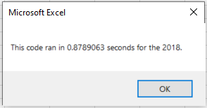

# Stock Analysis Project

## Overview of Project

**Purpose:**  
Steve is helping his parents with stock investments, but wants more information on different stocks to fully assist his parents to make wise decisions on their investment choices. The purpose of this analysis is to provide Steve with the full picture of how specific stocks has performed over the past years, as well as providing an easy way for Steve to perform the same analysis for future years.

## Analysis and Results

**Analysis of All Tickers (2017 and 2018):**  
We performed an analysis for finding both Total Daily Volume and the Return of 12 different stock tickers. Total Daily Volume means the amount of stock that are sold or traded in a day ([Traders-Paradise Reference](https://traders-paradise.com/magazine/2020/03/the-average-daily-trading-volume-how-to-calculate/#:~:text=Daily%20volume%20is%20the%20total%20number%20of%20shares,has%20a%20great%20impact%20on%20the%20stock%20price.){:target="_balnk"}). Return is the percent increase or decrease from the start of the year less end of the year. We can see that the overall performance of the 12 tickers are positive in 2017, but noticed an overall decrease in 2018, except for ENPH and RUN which maintained a positive return in both years. As well with TERP which maintained a negative return in both 2017 and 2018.  
 

**Analysis of DQ Ticker (2017 and 2018):**  
Steve's parents were wanting to invest in DQ stock. Looking back to the charts above, if Steve's parents invested in DQ in 2017, that would be a good decision as we saw an increase in return of 199%. The opposite would be true if they invested in 2018 with a decrease in return of 62%. Obviously we don't know what stock prices will be in the future, but looking at past results can give a glimps of what it might look like in the future, or at least treads of the expected result. By looking at past results, Steve would be able to give an informed input on helping his parents make knowledgeable decisions on investments.

**Marco and Refractoring Macro:**  
During this project, we were able to write Macros in VBA to assist with our analaysis in analyzing our data to provide accurate results for Steve, as well as saving time from sorting through our data by tickers, daily volume, and the return. Another benefit with our Macro scripts, we can use them in the future when we are wanting to perform the same analaysis but for different years. We also refactored our macro to run faster and more efficient as noted in the images below. This is useful if our dataset gets larger in the future.  
 
 

## Summary 

- Advantages and Disadvantages of refactoring code (in general)  
In a sense, why fix what's not broken? An advantage of refactoring code is that it will run faster, as noted in the images above on time elasped for the scripts. Another advantage to refactoring code is to clean up the design of the code, so it would be easier to maintain and read for future users. One disadvantage of refactoring code is that requires time to edit and clean up the code so that it would be easier to use. Another disadvantage that I personally encountered was that I was getting bugs and had to debug the errors that occurred when refactoring the code, which was time consuming and had to take up other resources to solve and fix the problem.

- Advantages and Disadvantages of the original and refactored VBA script  
An advantage of the refactored VBA script, was that it ran faster compared to the origial script, so I guess that would also be a disadvantage of the original code. A disadvantage of the refactored script would be that bugs could occur when changing or modifying the code. I personally was getting bugs and took a while for me to identify and fix the errors that occurred, which took time and resources. In terms of understanding how the code works, this would allow the user to understand how or why the refactored code/script would run faster and efficiently.

### Codes Used (Original on left, Refactored on right)
  
  
  